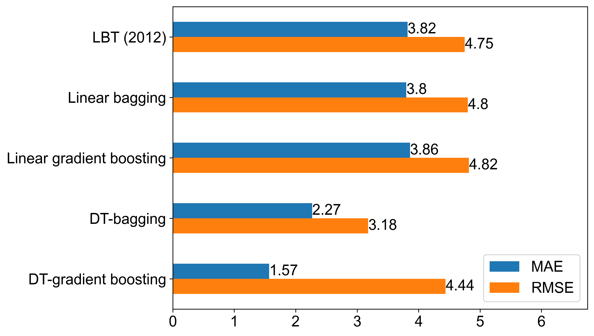
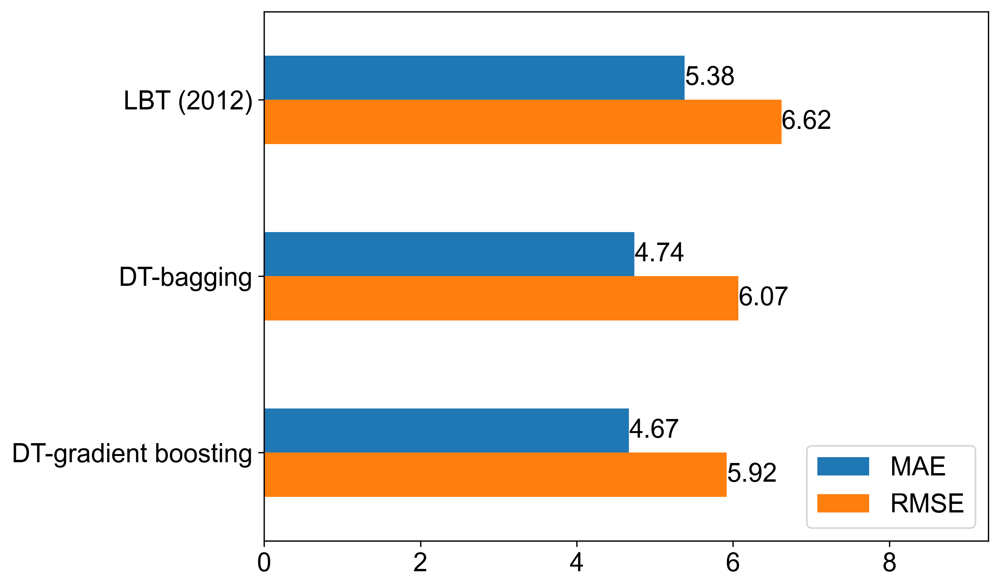
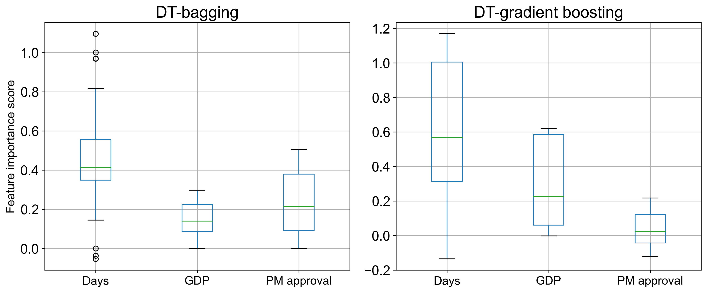
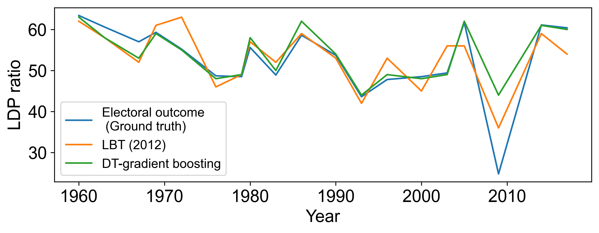

# Forecasting of japanese election
This is the implement of the paper "Forecasting Japanese elections by ensemble decision tree models".

# Install 
```c
pip install -r ./requirements.txt
```
# Forecasting
```c
python forcasting_best_param.py
```

# Japanese election data
```python
Year LDP_seats GDP PM_approval DAYS
1960	63.4	9.42	41.6	913
1963	60.6	8.6	38.7	1096
1967	57	10.25	25.8	1165
1969	59.3	11.91	37.9	1063
1972	55.2	4.39	54.8	1079
1976	48.7	3.09	29.5	1456
1979	48.5	5.27	26	1036
1980	55.6	5.48	29.1	259
1983	48.9	3.38	37.3	1274
1986	58.6	6.33	42.6	931
1990	53.7	5.37	36.5	1323
1993	43.6	0.82	23.1	1246
1996	47.8	2.74	39.8	1190
2000	48.5	-0.25	30.4	1344
2003	49.4	0.12	49.6	1232
2005	61.7	2.2	39.9	672
2009	24.8	-1.09	16.3	1449
2012	61.3	-0.12	17.3	1204
2014	61.1	2	45.5	728
2017	60.4	1.03	41.8	1043
```

# The performance of the proposed ensemble learning and benchmark models 




# The feature importance score based on DT-bagging and DT-gradient boosting models.


# The forecasting result



 
